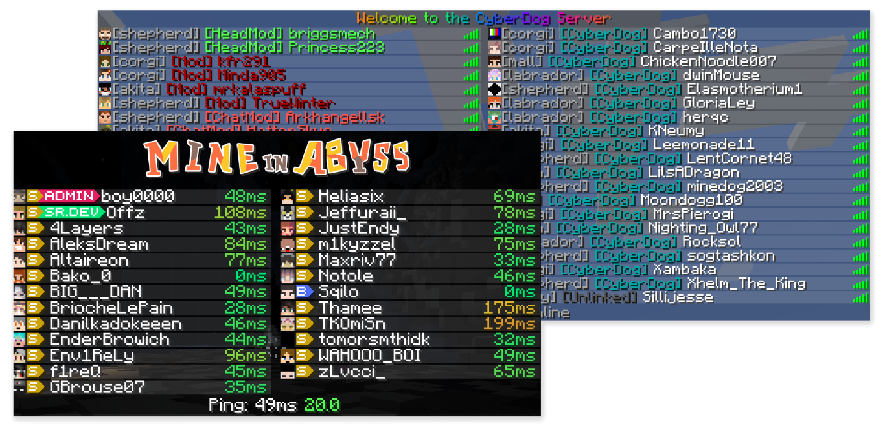

<!--suppress ALL -->
<p align="center">
    
    <a href="https://github.com/WiIIiam278/Velocitab/actions/workflows/ci.yml">
        
    </a> 
    <a href="https://repo.william278.net/#/releases/net/william278/velocitab/">
        
    </a>
    <a href="https://discord.gg/tVYhJfyDWG">
        
    </a> 
    <br/>
    <b>
        <a href="https://modrinth.com/plugin/velocitab">Modrinth</a>
    </b> —
    <b>
        <a href="https://william278.net/docs/velocitab/setup">Setup</a>
    </b> — 
    <b>
        <a href="https://william278.net/docs/velocitab/">Docs</a>
    </b> — 
    <b>
        <a href="https://github.com/WiIIiam278/Velocitab/issues">Issues</a>
    </b>
</p>
<br/>

**Velocitab** is a super-simple Velocity TAB menu plugin that uses scoreboard team client-bound packets to actually sort player lists without the need for a backend plugin. Supporting modern RGB formatting, animations, comprehensive placeholder support and defining multiple TAB menus for different groups of servers, Velocitab is a versatile plugin, useful for any Velocity-based proxy network.



## Features
**⭐ Flexible list sorting** &mdash; Customizable TAB [list sorting](https://william278.net/docs/velocitab/sorting) based on user role, server, placeholder, and more.

**⭐ Versatile formatting support** &mdash; Make your TAB list beautiful with full RGB color support, supporting MiniMessage, MineDown and legacy [formatting modes](https://william278.net/docs/velocitab/formatting).

**⭐ Multiple TAB menus for different servers** &mdash; Create [server groups](https://william278.net/docs/velocitab/server-groups) and configure different TAB lists to show for each group!

**⭐ Animations support** &mdash; Add extra flair to your TAB list or display additional information by creating pretty looking [animations](https://william278.net/docs/velocitab/animations).

**⭐ Player nametags** &mdash; Customize how over-the-head [nametags](https://william278.net/docs/velocitab/nametags) look to help players stand out in-game.

**⭐ Full placeholder support** &mdash; Comes with a robust set of built-in [placeholders](https://william278.net/docs/velocitab/placeholders), MiniPlaceholders support, as well as PAPIProxyBridge for PlaceholderAPI support

**Ready?** [Get started in a new TAB&hellip;](https://william278.net/docs/velocitab/setup)

## Setup
We suggest installing [LuckPerms](https://luckperms.net) on your Velocity proxy and backend (Spigot, Paper, Fabric, etc.) servers for prefix/suffix formatting right out the box.

1. Turn off your Velocity proxy server
2. [Download](https://github.com/WiIIiam278/Velocitab/releases/latest) and place the plugin jar file in the `/plugins/` folder of your Velocity proxy server.
3. Start your Velocity proxy, and allow the plugin to generate its config file
4. Edit the [`config.yml` file](https://william278.net/docs/velocitab/config-file) to your liking
5. Restart your Velocity proxy again

Need to make a quick config change? You can use the in-game `/velocitab reload` (permission: `velocitab.command.reload`) command, though we recommend restarting your proxy server for any major changes.

## Building
To build Velocitab, run the following in the root of the repository:
```bash
./gradlew clean build
```
The build will be output as `/target/Velocitab-x.xx.jar`.

### License
Velocitab is licensed under the Apache 2.0 license.

- [License](https://github.com/WiIIiam278/Velocitab/blob/master/LICENSE)

## Links
* **[Website](https://william278.net/project/velocitab)** — Visit my website!
* **[Docs](https://william278.net/docs/velocitab)** — Read the plugin docs!
* **[Modrinth](https://modrinth.com/plugin/velocitab)** — View the plugin Modrinth page (Also: [Hangar](https://hangar.papermc.io/William278/Velocitab))
* **[Issues](https://github.com/WiIIiam278/Velocitab/issues)** — File a bug report or feature request
* **[Discord](https://discord.com/invite/tVYhJfyDWG)** — Get support, ask questions!

---
&copy; [William278](https://william278.net/), 2024. Licensed under the Apache-2.0 License.
